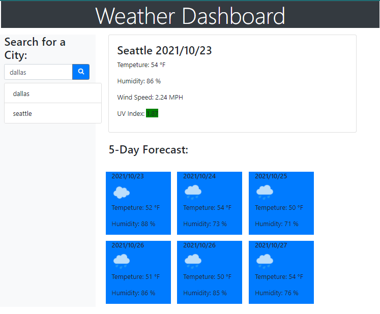

# Weather Dashboard

## Weather Dashboard that retrieves data from 3rd party application's APIs.

### APIs Used:
> Weather API to get current weather based on city value
> UV index API to pull related weather values
> Forecast API to get a 5-day forecast for the week

### Application Built With:
- HTML
- CSS styling
- Javascript
- Bootstrap
- jQuery

